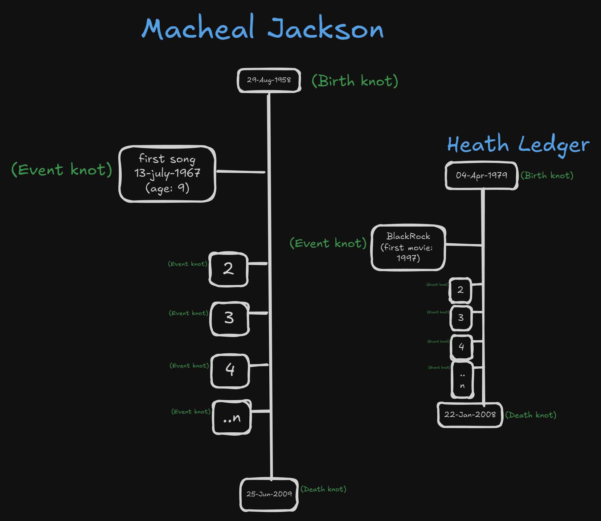

# Dangler

1. Individuals: suppose we have a historical person like a Michael Jackson. his life span will represented as a vertical tube, he born in 1958, so his tube will start with a know (his birth date) then tube continues down. but at every major points of his life his tube will have a knot for that. like his first song release date is (13-july-1967) so his pipe have the knot on that date, when we click on that date it will open the detailed information about that event (text information, photos, media or embedded file). a knot for his marriage, a knot for his children, a final knot will be his death.

2. Some famous people are still alive so app will have the their unfinished tube.

3. I want the 4 section for that
I) People: 
	A. Real People
	B. Fictional Characters
		a. Movie Characters
		b. Show or Series Characters
		c. Game Characters
	C. Mythological Characters
	D. Obscure Characters which we are not sure if they are real, mythological or fictional

II) Business & Companies

III) Things & Products

IV) Animal & species
	A. Current
	B. Extinct

V) Idiology
	A. Religions
	B. Thought processes

4. compare the multiple person: we can compare 2 or more person with each other with there particular pipes, for example
we can compare Michael Jackson with Heath Ledger (comparing Michael's Tube with Heath's Tube along side with each other).

5. Tags Mechanism
   A. Tag Strucutre:
	I) Individuals tags: Name, Roles (moviestar, writter, poet, queen, king).
	II) Tag Type: types of tags like (character, Thing Region, Theme).
	
	B. User input
	I) Tag Creation
	II) Tag Suggestion

	C. Moderation
	I) Report 
	II) Review
	III) Decision

	D. Search Functionality
	I) Keyword Search
	II) (+)Inclusion & (-)Exclusion of tags.  
### Preview:  
  